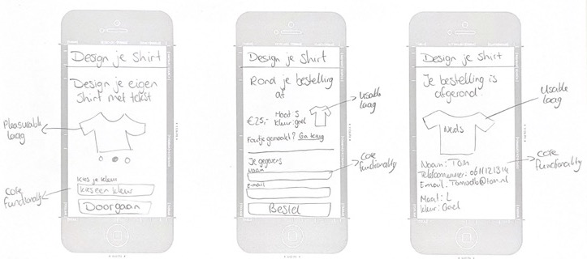

# Browser Technologies @cmda-minor-web 20-21

Welkom bij het project van het vak Browser Technologies. Bij dit project van de Minor 'Webdesign and development' is het doel van deze opdracht is te leren hoe je een online interactieve toepassing kan maken met behulp van Progressive Enhancement en Feature Detection zodat de applicatie het altijd doet.

- Opdracht 1: https://sophievanderburg.github.io/opdracht1-BT/
- Opdracht 2: https://maggness.github.io/BT-Tim/opdracht2-BT-main/

## Inhoudsopgave

- [Progressive enhancement](#progressive-enhancement)
- [User Story](#user-story)
- [Wireflow](#wireflow)
- [Hoe te gebruiken?](#hoe-te-gebruiken)
- [Browser testing](#browser-testing)
- [Test verslag](#test-verslag)
- [Licence](#licence)
- [Credits](#credits)

## Progressive enhancement

Progressive enhancement zorgt ervoor dat gebruikers de best mogelijke website ervaring krijgen.
Het principe is dat een website begint met een sterke basis, waarna de website in een aantal stappen
uitgebreid wordt om de website nog beter te maken. Het idee is dus dat een website simpel begint,
maar steeds verder wordt uitgebreid naar een steeds complexere website. Het komt er dus op neer dat
er eerst gefocust wordt op de content van een website.

Als progressive enhancement wordt toegepast zorgt het ervoor dat de website voor elke browser en voor
elke browser werkend is en stabiel is. Zo kunnen gebruikers met een verouderde browser nog steeds de website
bezoeken met de basiswebsite, terwijl bezoekers met een moderne browser de extra features van de website kunnen zien.

#### Toepassing van progressive enhancement

Bij het bouwen van een website met progressive enhancement wordt er als eerst gefocust op de HTML met daarbij
de content van de pagina. Dit is de eerste laag van de website en deze is dus ook het belangrijkst. Als deze laag werkt
kan elke bezoeker, ongeachte de browser, de website bezoeken waar het voor bedoelt is.

De tweede laag is de CSS. Hiermee kan de website gestijld worden en dit zorgt ervoor dat alles op de website op de goede plek staat.
Als er nog hele oude browsers zijn die geen CSS ondersteunen, kan de bezoeker evengoed de content zien van de website.

De laatste laag is JavaScript. Hiermee kunnen animaties en interactieve elementen toegevoegd worden aan een website.
Dit is het minst belangrijk aan een website, waardoor het ook niet nodig is om een website te bekijken of gebruiken.
De website kan dus ook gebruikt worden zonder deze laag.

#### Eigen toepassing van progressive enhancement

Ik heb dit aan mijn app door middel omdat de CSS niet nodig is. Als de CSS wegvalt ziet de website er minder
netjes uit, maar de content van de website is nog steeds leesbaar. Dit is bijvoorbeeld mogelijk door het downloaden van
de fonts, in plaats van door de fonts te linken.

Voor JavaScript geldt hetzelfde. De ervaring van de website is minder leuk, maar de content is nog steeds te zien.

## User story

> Ik wil mijn eigen t-shirt-met-nerdy-tekst kunnen ontwerpen, opslaan, bestellen, en een volgende keer dat ik de site bezoek kunnen gebruiken.

## Wireflow

## Features

**Gegevens maker (naam, telefoon of email)** 
Deze feature behoort tot de core functionaliteit. Ik heb deze feature toegevoegd door middel van forms. De ingevulde gegevens komen terug op de bevestigingspagina.  

**Kleur t-shirt** 
Deze feature behoort ook tot de core functionaliteit van de website. Dit is toegevoegd door middel van een drop-down met alle kleuren. Dit wordt gebruikt om de kleur van het shirt te bepalen. Dit komt ook terug in de SVG zelf.  

**Tekst t-shirt** 
Deze feature behoort tot de core functionaliteit. De gebruiker heeft de mogelijkheid om een tekst voor op het shirt toe te voegen, maar dit is niet vereist. De ingevoerde tekst is onder andere op de bevestigingspagina terug te zien op het shirt.  

**Maat t-shirt** 
De maat van het shirt behoort ook tot de core-functionaliteit. Deze wordt toegevoegd door middel van een drop-down met de beschikbare maten.  

**Geslacht** 
Deze functie heb ik niet toegevoegd, omdat deze t-shirts unisex zijn.  

**Verder gaan waar je gebleven bent/ontwerp herzien** 
Deze functionaliteit heb ik deels gerealiseerd. Dit is een usable functionaliteit, omdat de website goed te gebruiken is als JavaScript is uitgeschakeld. De gebruiker kan teruggaan naar de eerste stap met de ingevoerde velden, maar als het shirt is besteld, wordt de localStorage verwijderd. Dit omdat de gebruiker dan een nieuw shirt kan bestellen zonder dat de velden al van te voren zijn ingevuld.  

**Validatie: alles moet zijn ingevuld. Geef duidelijke foutmeldingen** 
Deze functionalitetit heb ik gerealiseerd door middel van de input attributes in HTML. Ik heb hiervoor gekozen omdat de validatie dan altijd werkt.  

- Gebruiker moet meerdere t-shirts kunnen maken en herzien, en moet dus een overzichtspagina hebben.

**Bestel pagina om een ontwerp kopen en laten maken** 
Deze functionaliteit is gerealiseerd in de app. De gebruiker komt na de bestelling bij een pagina met een samenvatting van het bestelde shirt en de gegevens. Dit hoort bij de core functionaliteit omdat het belangrijk is dat de gebruiker dit te zien krijgt.

## Geteste browsers

- Firefox
- Safari
- Google Chrome

- iOS
- IE11 mobile
- Chrome for Android
- Playstation Browser

## Test verslag

De CSS functie `@supports` wordt niet ondersteund op IE11. Daarom heb ik dit niet gebruikt.

Ik heb expres `var` in plaats van `const` en `let` gebruikt in JavaScript, omdat `var` bij meerdere oudere browsers ondersteund wordt.
